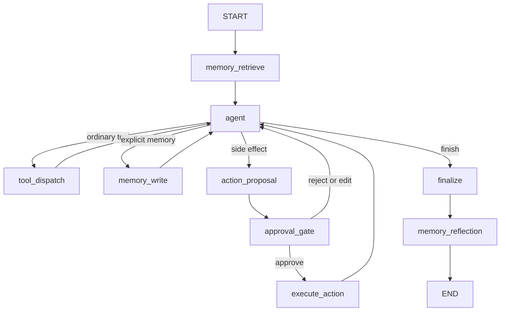

# Runtime Flow v0.1

## Before graph invocation

`main.py -> bootstrap_application -> load/validate config -> resolve paths ->
construct RuntimeContext -> build_graph -> Application`.

This composition step is not a LangGraph node and does not invoke the graph.

## Main flow

Every task starts by retrieving relevant long-term memory, then enters the agent
decision node. Routing selects one of the four exits: ordinary tool dispatch,
explicit memory write, side-effect proposal, or finalization.

## Node responsibilities

- `memory_retrieve`: reserved pre-task retrieval boundary; currently unchanged.
- `agent`: reserved for future non-deterministic reasoning; currently chooses the
  safe finish path.
- `tool_dispatch`: ordinary capability dispatch boundary; placeholder only.
- `memory_write`: explicit user-memory write boundary; placeholder only.
- `action_proposal`: creates the approval boundary concept; placeholder only.
- `approval_gate`: approval/rejection/edit boundary; never assumes approval.
- `execute_action`: reserved for approved effects; currently unavailable.
- `finalize`: terminal response boundary; currently unchanged.
- `memory_reflection`: post-task reflection boundary; placeholder only.

## Routing

`route_after_agent` sends a pending action to the action path, a future explicit
memory/tool request to its named boundary, and otherwise sends the state to
`finalize`. `route_after_approval` only sends an explicitly approved proposal to
`execute_action`; every other decision returns to `agent`.

## Safe default

The default path is:

`START -> memory_retrieve -> agent -> finalize -> memory_reflection -> END`

It does not call an LLM, execute a tool, persist memory, or perform a side effect.

## Implementation status

The builder uses `StateGraph`, registers all named architecture nodes, and defines
the conditional edges. The domain models and protocols are real Python shapes.
All external integrations and action execution are explicit placeholders and may
raise `NotImplementedError` when deliberately invoked.

## Next implementation order

1. Review and freeze state/routing contracts.
2. Select a checkpoint backend, with SQLite as the first target.
3. Define one safe filesystem capability and its approval behavior.
4. Add a real LLM adapter behind the runtime boundary.
5. Implement canonical memory stores and retrieval/reflection incrementally.
